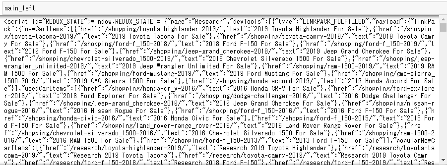
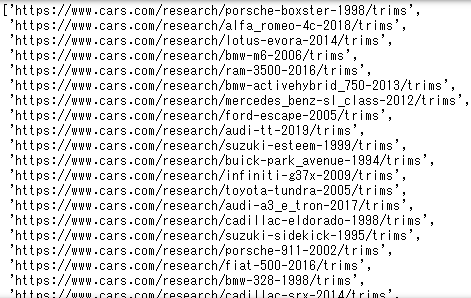
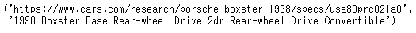
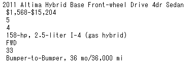

# Scraping reviews and specifications from cars.com

I am looking for a new car to buy, and I am going to do some analytics using data on [cars.com](https://www.cars.com/research/) to identify the cars I want to consider purchasing. [cars.com](https://www.cars.com/research/) has data on 2636 cars from model years 1991 to 2020 as of Sep 16, 2019. I want to do text mining on review comments which I can obtain from https://www.cars.com/research/ and the specifications of the cars. There are many elements of specifications that are not standardized so I will be using only the standardized elements of specifications which are identifiable by the `id` attribute of the `<td>`


This repository is for scraping highlevel specifications of the cars on cars.com and parse them into a csv table. The code for scraping reviews comments are in my another repository [carsreview](https://github.com/stomioka/carsreview). The code for scraping all of the specifications without using Spider will be added to another repository.


## 1. install scrapy==1.7.3
## 2. Create a project folder
```cmd

C:\Users\Sam>cd /d G:\GoogleDrive\GitHub\cars
G:\GoogleDrive\GitHub\cars>mkdir trims
G:\GoogleDrive\GitHub\cars>cd trims
G:\GoogleDrive\GitHub\cars\trims>scrapy startproject cartrims
New Scrapy project 'cartrims', using template directory 'c:\users\sam\anaconda3\lib\site-packages\scrapy\templates\project', created in:
    G:\GoogleDrive\GitHub\cars\trims\cartrims

You can start your first spider with:
    cd cartrims
    scrapy genspider example example.com

```

## 3. Obtain URLs to get reviews and specifications

The first step is to obtain the list of all cars available through cars.com. Fortunately, it can be generated by parsing the [research page](https://www.cars.com/research\). This list will be then used to generate the list of URLs containing the overview specifications.

```python
from requests import get
from bs4 import BeautifulSoup
import re
import pandas as pd
import numpy as np

url = 'https://www.cars.com/research/'
response = get(url)
page_html = BeautifulSoup(response.text,'html.parser')
page_title = page_html.find('title').text

try:
    main_left = page_html.find('script', attrs = {'id':'REDUX_STATE'})
except:
    None
```

List of cars, years and URL to each trim URL are stored as redux state. Here is the code to extract information and store them in a dataframe. `model_pass` is the name of the model used in the URL for specifications.


```python
data=re.split('{|}',main_left.get_text())
data=[i for i in data if re.search(r'makeId', i)]
data=[','.join(i.split(':')) for i in data]
cars=pd.DataFrame()
cars['id']=[i.split(',')[1] if len(i.split(',')[1])>3 else '' for i in data]
cars['model']=[i.split(',')[3]  if i.split(',')[3]!='"0"' else '' for i in data]
cars['model_pass']=[i.split(',')[5].split('-')[1].split('"')[0] if re.search('-',i.split(',')[5] ) else '' for i in data]
cars['brand']=[i.split(',')[5].split('-')[0].split('"')[1] if re.search('-',i.split(',')[5] ) else '' for i in data]
cars['makeId']=[i.split(',')[7] if len(i.split(','))>=7 else '' for i in data]
cars['years']=[i[i.find('years')+8:-1].split(',') for i in data]
cars.shape
```
Out: (2639, 6)

I removed invalid records.
```
cars=cars[cars['brand']!='']
cars.reset_index(inplace=True)
cars.shape
```
Out: (2636, 6)

I generated two lists of URLs. The first list is the URLs for review comments, and the second one is the URLs for each trim.

I will get up to 250 reviews for each page, and for each trim, I will obtain upto 750 reviews..

```python
#review data
urllst = []
for brand in cars['brand']:
    car_brand=cars[cars['brand']==brand]
    for model in car_brand['model_pass']:
        car_model=car_brand[car_brand['model_pass']==model]
        for yearlst in car_model['years']:
            for year in yearlst:
                for i in range(1,4):
                    urllst.append('https://www.cars.com/research/{}-{}-{}/consumer-reviews/?pg={}&nr=250'.format(brand, model, year, i))
urllst=list(set(urllst))

#trim data
urllst2 = []
for brand in cars['brand']:
    car_brand=cars[cars['brand']==brand]
    for model in car_brand['model_pass']:
        car_model=car_brand[car_brand['model_pass']==model]
        for yearlst in car_model['years']:
            for year in yearlst:
                    urllst2.append('https://www.cars.com/research/{}-{}-{}/trims'.format(brand, model, year))
urllst2=list(set(urllst2))
urllst2
```
Out: <br>

## 4. Build spiders
Spiders are classes that I need to define. Scrapy uses it to scrape information from cars.com. This example is for getting the overview specification of each car, and parse them to make a DataFrame.
### 4.1 Build a list of URLs

`Selector` in `scrapy.selector` makes intuitive to parse the html code.

```python
from lxml import html
from scrapy.selector import Selector
```
I built a parser with a small data. This function will be placed in `cartrims` class later.
```python
trimurls=[]
models=[]
def get_trim_url(url):
    trimurl=[]
    try:
        data = request.urlopen(url)
        response=Selector(text=data.read())
        trim=response.xpath('.//script[@type="application/ld+json"]/text()').getall()
        for i in range(1, len(trim)):
            model=trim[i].split('"name":')[1].split('"model":')[0].split('"')[1]
            print('Model{}: {}'.format(i, model))
            models.append(model)
            trimurl_tmp=trim[i].split('@id":"')[1].split('"')[0]
            trimurl.append(trimurl_tmp)
    except:
        pass


    return trimurl


for url in urllst2[0:15]:
    trimurls.append(get_trim_url(url))

trimurls=[i[:-11] for sub in trimurls for i in sub]
trimurls=list(set(trimurls))

```

```python
trimurls[0], models[0]
```


### 4.2 Parser
Make sure I can get the items from overview specification table, I am testing with one URL.

```
url=trimurls[0]
trim=models[0]
data = request.urlopen(url)
raw_html = data.read()
response=Selector(text=raw_html)

trim_ = response.xpath('//span[@class="specs-photo__desc"]/text()').extract_first()
print('parse')
trim = trim_[12:]
year = trim_[0:4]
make = trim_.split(' ')[1]
price=  response.xpath('//span[@class="specs-price__value"]/text()').extract_first()
seats = response.xpath('//td[@id="seats"]/text()').extract_first()
doorCount =response.xpath('//td[@id="doorCount"]/text()').extract_first()
engine =response.xpath('//td[@id="engine"]/text()').extract_first()
drivetrain =response.xpath('//td[@id="drivetrain"]/text()').extract_first()
mpg =response.xpath('//td[@id="mpg"]/text()').extract_first()
warranty =response.xpath('//td[@id="warranty"]/text()').extract_first()

print(trim
      ,'\n',year
      ,'\n',make
      ,'\n',price
      ,'\n',seats
      ,'\n',doorCount
      ,'\n',engine
      ,'\n',drivetrain
      ,'\n',mpg
      ,'\n',warranty
      )
```


## 5 Build a project.

Start from a directory where I want to create a project, run this command.

```cmd
scrapy startproject cartrims
```
It will generate following folders and files.

Separately, I am making the folder `data` to store the output csv files.

```
cartrims/
    scrapy.cfg            # configuration file

    data/                 # output folder

    cartrims/             # project's Python module
        __init__.py

        items.py          # project items definition file

        middlewares.py    # project middlewares file

        pipelines.py      # project pipelines file

        settings.py       # project settings file

        spiders/          # a directory for my spider
            __init__.py

            cartrims.py   # my spider
```

### 5.1 Spider Setup

#### `settings.py`

```python
BOT_NAME = 'cartrims'
SPIDER_MODULES = ['cartrims.spiders']
NEWSPIDER_MODULE = 'cartrims.spiders'
# Crawl responsibly by identifying yourself (and your website) on the user-agent
USER_AGENT = 'cartrims (st)'
# Obey robots.txt rules
ROBOTSTXT_OBEY = True
DOWNLOAD_DELAY = 1
ITEM_PIPELINES = {'cartrims.pipelines.WriteItemPipeline':200}
```

#### `pipelines.py`
```python
from scrapy.exceptions import DropItem
from scrapy.exporters import CsvItemExporter

class CartrimsPipeline(object):
    def process_item(self, item, spider):
        if not all(item.values()):
            raise DropItem("Missing values!")
        else:
            return item

class WriteItemPipeline(object):

    def __init__(self):
        self.filename = 'data/carstrim-specs.csv' #define the output

    def open_spider(self, spider):
        self.csvfile = open(self.filename, 'wb')
        self.exporter = CsvItemExporter(self.csvfile)
        self.exporter.start_exporting()

    def close_spider(self, spider):
        self.exporter.finish_exporting()
        self.csvfile.close()

    def process_item(self, item, spider):
        self.exporter.export_item(item)
        return item
```
#### `middlewares.py`
Use it as is

#### `items.py`
Here I define items defined in Sec 4.2.
```python
import scrapy


class CartrimsItem(scrapy.Item):
    # define the fields for your item here like:
    # name = scrapy.Field()

    Category            = scrapy.Field()
    year            = scrapy.Field()
    make            = scrapy.Field()
    price           = scrapy.Field()
    seats           = scrapy.Field()
    doorCount       = scrapy.Field()
    engine          = scrapy.Field()
    drivetrain      = scrapy.Field()
    mpg             = scrapy.Field()
    warranty        = scrapy.Field()
```

#### Spiders
I named Spider as cartrims and created `cartrims.py`. Basically it is created from the scripts I created in Sec 3 and 4.1.

```python
# -*- coding: utf-8 -*-
"""
Created on Sun Sep 15 07:49:16 2019

@author: Sam
"""

from scrapy import Spider
from cartrims.items import CartrimsItem
from requests import get
from bs4 import BeautifulSoup
import re
import pandas as pd
import numpy as np
from urllib import request
from scrapy.selector import Selector


class Carsreview(Spider):
    name = 'cartrims'
    url = 'https://www.cars.com/research/'
    response_ = get(url)
    page_html = BeautifulSoup(response_.text,'html.parser')
    page_title = page_html.find('title').text

    try:
        main_left = page_html.find('script', attrs = {'id':'REDUX_STATE'})
    except:
        None

    data=re.split('{|}',main_left.get_text())
    data=[i for i in data if re.search(r'makeId', i)]
    data=[','.join(i.split(':')) for i in data]
    cars=pd.DataFrame()
    cars['id']=[i.split(',')[1] if len(i.split(',')[1])>3 else '' for i in data]
    cars['model']=[i.split(',')[3]  if i.split(',')[3]!='"0"' else '' for i in data]
    cars['model_pass']=[i.split(',')[5].split('-')[1].split('"')[0] if re.search('-',i.split(',')[5] ) else '' for i in data]
    cars['brand']=[i.split(',')[5].split('-')[0].split('"')[1] if re.search('-',i.split(',')[5] ) else '' for i in data]
    cars['makeId']=[i.split(',')[7] if len(i.split(','))>=7 else '' for i in data]
    cars['years']=[i[i.find('years')+8:-1].split(',') for i in data]
    cars=cars[cars['brand']!='']
    cars.reset_index(inplace=True)
    print('Shape of Cars Dataframe: {}'.format(cars.shape))

    cars_review =  pd.DataFrame({'id':np.repeat(cars['id'], cars['years'].str.len()),
                        'model':np.repeat(cars['model'], cars['years'].str.len()),
                        'model_pass':np.repeat(cars['model_pass'], cars['years'].str.len()),
                        'brand':np.repeat(cars['brand'], cars['years'].str.len()),
                        'makeId':np.repeat(cars['makeId'], cars['years'].str.len()),
                        'years': np.concatenate(cars['years'])})
    cars_review.drop_duplicates(inplace=True)

    cars_review.to_csv('data/cars_list_by_year.csv')
    urllst2 = []

    for brand in cars['brand']:
        car_brand=cars[cars['brand']==brand]
        for model in car_brand['model_pass']:

            car_model=car_brand[car_brand['model_pass']==model]
            for yearlst in car_model['years']:
                for year in yearlst:
                        urllst2.append('https://www.cars.com/research/{}-{}-{}/trims'.format(brand, model, year))

    urllst2=list(set(urllst2))
    print('list of URLs {}'.format(len(urllst2)))
    ##obtain spec overview page url for each trim


    trimurls=[]

    def get_trim_url(url):
        trimurl=[]
        models=[]
        try:
            data = request.urlopen(url)
            response=Selector(text=data.read())
            trim=response.xpath('.//script[@type="application/ld+json"]/text()').getall()
            for i in range(1, len(trim)):
                model=trim[i].split('"name":')[1].split('"model":')[0].split('"')[1]
                #print('Model{}: {} \n URL: {}'.format(i, model, url))
                models.append(model)
                trimurl_tmp=trim[i].split('@id":"')[1].split('"')[0]
                trimurl.append(trimurl_tmp)
        except:
            pass


        return trimurl


    for url in urllst2:
        trimurls.append(get_trim_url(url))

    trimurls=[i[:-11] for sub in trimurls for i in sub]


    start_urls =list(set(trimurls))
    print('Start crawling')


    def parse(self, response):

        trim_ = response.xpath('//span[@class="specs-photo__desc"]/text()').extract_first()
        print('parse')
        trim = trim_[12:]
        year = trim_[0:4]
        make = trim_.split(' ')[1]
        price=  response.xpath('//span[@class="specs-price__value"]/text()').extract_first()
        seats = response.xpath('//td[@id="seats"]/text()').extract_first()
        doorCount =response.xpath('//td[@id="doorCount"]/text()').extract_first()
        engine =response.xpath('//td[@id="engine"]/text()').extract_first()
        drivetrain =response.xpath('//td[@id="drivetrain"]/text()').extract_first()
        mpg =response.xpath('//td[@id="mpg"]/text()').extract_first()
        warranty =response.xpath('//td[@id="warranty"]/text()').extract_first()

        item = CartrimsItem()
        item['trim'] = trim  #add these later after correct way to loop through urls is
        item['year'] = year
        item['make'] = make
        item['price'] = price
        item['seats'] = seats
        item['doorCount'] = doorCount
        item['engine'] = engine
        item['drivetrain'] = drivetrain
        item['mpg'] = mpg
        item['warranty'] = warranty
        yield item

```

## Run Spider and generate the output

Just navigate to the folder where scrapy.cfg is saved, and run this.
```
scrapy crawl cartrims
```
