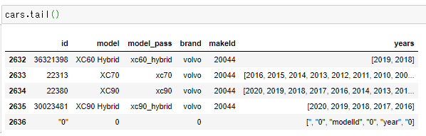
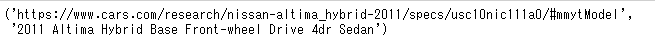

# Scraping reviews and specifications from cars.com


## 1. install scrapy==1.7.3
## 2. create a project folder
```cmd

C:\Users\Sam>cd /d G:\GoogleDrive\GitHub\cars
G:\GoogleDrive\GitHub\cars>mkdir trims
G:\GoogleDrive\GitHub\cars>cd trims
G:\GoogleDrive\GitHub\cars\trims>scrapy startproject cartrims
New Scrapy project 'cartrims', using template directory 'c:\users\sam\anaconda3\lib\site-packages\scrapy\templates\project', created in:
    G:\GoogleDrive\GitHub\cars\trims\cartrims

You can start your first spider with:
    cd cartrims
    scrapy genspider example example.com

```

## 3. Obtain URLs to get reviews and specifications

```python
from requests import get
from bs4 import BeautifulSoup
import re
import pandas as pd
import numpy as np

url = 'https://www.cars.com/research/'
response = get(url)
page_html = BeautifulSoup(response.text,'html.parser')
page_title = page_html.find('title').text

try:
    main_left = page_html.find('script', attrs = {'id':'REDUX_STATE'})
except:
    None
```

List of cars, years and URL to each trim URL are stored as redux state. Next step is to parse them. I will create a dataframe to store them.


```python
data=re.split('{|}',main_left.get_text())
data=[i for i in data if re.search(r'makeId', i)]
data=[','.join(i.split(':')) for i in data]
cars=pd.DataFrame()
cars['id']=[i.split(',')[1] for i in data]
cars['model']=[i.split(',')[3].split('"')[1] for i in data]
cars['model_pass']=[i.split(',')[5].split('-')[1].split('"')[0] if len(i.split(','))>=7 else '' for i in data]
cars['brand']=[i.split(',')[5].split('-')[0].split('"')[1] for i in data]
cars['makeId']=[i.split(',')[7] if len(i.split(','))>=7 else '' for i in data]
cars['years']=[i[i.find('years')+8:-1].split(',') for i in data]
cars.shape
```
Out: (2637, 6)

The last record is invalid so I will remove it.

```
cars=cars[cars['model']!='0']
```
I will generate to listings. One for comments, and the second one for trims.
I will get up to 750 reviews per model.

```python
#review data
urllst = []
for brand in cars['brand']:
    car_brand=cars[cars['brand']==brand]
    for model in car_brand['model_pass']:
        car_model=car_brand[car_brand['model_pass']==model]
        for yearlst in car_model['years']:
            for year in yearlst:
                for i in range(1,4):
                    urllst.append('https://www.cars.com/research/{}-{}-{}/consumer-reviews/?pg={}&nr=250'.format(brand, model, year, i))
urllst=list(set(urllst))

#trim data
urllst2 = []
for brand in cars['brand']:
    car_brand=cars[cars['brand']==brand]
    for model in car_brand['model_pass']:
        car_model=car_brand[car_brand['model_pass']==model]
        for yearlst in car_model['years']:
            for year in yearlst:
                    urllst2.append('https://www.cars.com/research/{}-{}-{}/trims'.format(brand, model, year))
urllst2=list(set(urllst2))
```
## 4. create parsing function
### 4.1 specifications

to develop parsing function, import
```python
from lxml import html
from urllib import request
from scrapy.selector import Selector
```
and build parser with a small data
```python
testurls=urllst2[0:10]

trimurl=[]
trimurls=[]
models=[]
def get_trim_url(url):
    data = request.urlopen(url)
    raw_html = data.read()
    response=Selector(text=raw_html)

    trim=response.xpath('.//script[@type="application/ld+json"]/text()').getall()
    for i in range(1, len(trim)):
        model=trim[i].split('"name":')[1].split('"model":')[0].split('"')[1]
        models.append(model)
        trimurl_tmp=trim[i].split('@id":"')[1].split('"')[0]
        trimurl.append(trimurl_tmp)
    return trimurl


for url in testurls:
    trimurls.append(get_trim_url(url))

trimurls=[i for sub in trimurls for i in sub]
```

```python
trimurls[0], models[0]
```


Make sure I can get the items from overview specification table, I am testing with one URL.

```
url=trimurls[0]
trim=models[0]
data = request.urlopen(url)
raw_html = data.read()
response=Selector(text=raw_html)

#trim = response.xpath('//h1[@class="ym-headline"]/text()').get().split(',')[0]
price=  response.xpath('//span[@class="specs-price__value"]/text()').get()
seats = response.xpath('//td[@id="seats"]/text()').get()
doorCount =response.xpath('//td[@id="doorCount"]/text()').get()
engine =response.xpath('//td[@id="engine"]/text()').get()
drivetrain =response.xpath('//td[@id="drivetrain"]/text()').get()
mpg =response.xpath('//td[@id="mpg"]/text()').get()
warranty =response.xpath('//td[@id="warranty"]/text()').get()

print(trim
      ,'\n',price
      ,'\n',seats
      ,'\n',doorCount
      ,'\n',engine
      ,'\n',drivetrain
      ,'\n',mpg
      ,'\n',warranty
      )
```

